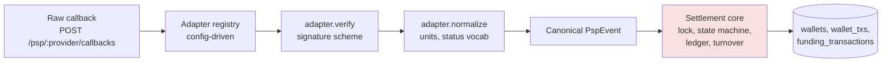

# DESIGN-PSP: the 50th PSP

**Goal:** a junior engineer integrates a new PSP in one day, without being able to break money movement.

## The boundary

All PSP-specific knowledge lives in an **adapter**; the settlement core never sees a raw payload.

```ts
interface PspAdapter {
  /** Reject forged/tampered requests. Throws on failure - nothing else runs. */
  verify(req: RawRequest, config: PspConfig): void;
  /** Translate the provider's dialect into our canonical event. */
  normalize(payload: unknown, config: PspConfig): PspEvent;
}

type PspEvent = {
  pspRef: string;
  status: 'completed' | 'failed' | 'pending'; // canonical vocabulary, not the PSP's
  amount: string;                             // major units, decimal string
};
```

Quirks are absorbed at the edge: minor-unit amounts are converted in `normalize`; weird status vocabularies map to the canonical three; a PSP that sends `success` before `pending` is neutralized because the core's state machine is **monotonic**: once a funding transaction is terminal, later regressions are no-ops or 409s (already true today).

## Routing & config

`POST /psp/:provider/callbacks` → registry lookup → adapter. The registry is built from config, so adding a PSP is **config + one adapter module + fixtures**, zero core changes:

```yaml
psps:
  acmepay:
    adapter: acmepay
    signingKey: ${ACMEPAY_SIGNING_KEY}
    amountUnits: minor
```

Verification lives in `verify` (adapter) because schemes differ (HMAC header, signed body, mTLS). Normalization lives in `normalize`. Settlement (locking, idempotency, ledger, turnover) lives in the core and is written once, reviewed hard, and never touched during an integration.

## Testing a provider you can't call in CI

1. **Recorded fixtures**: real sandbox callbacks captured once (payload + headers + signature) and committed. CI replays them through the adapter, no network needed.
2. **Shared contract suite**: every adapter must pass the same parametrized tests: valid callback normalizes correctly; tampered signature rejected; duplicate delivery; out-of-order statuses; garbage payload; minor/major unit conversion. A new adapter inherits nearly all of its test coverage by filling in fixtures.
3. Core settlement tests (already in `test/`) never change per PSP.

## Why a junior can do this safely

The blast radius of an adapter is one provider's callbacks. They write `verify`, `normalize`, config, and fixtures; the contract suite tells them when they're done. They cannot touch the code that moves money. That boundary, not seniority, is the safety mechanism.


